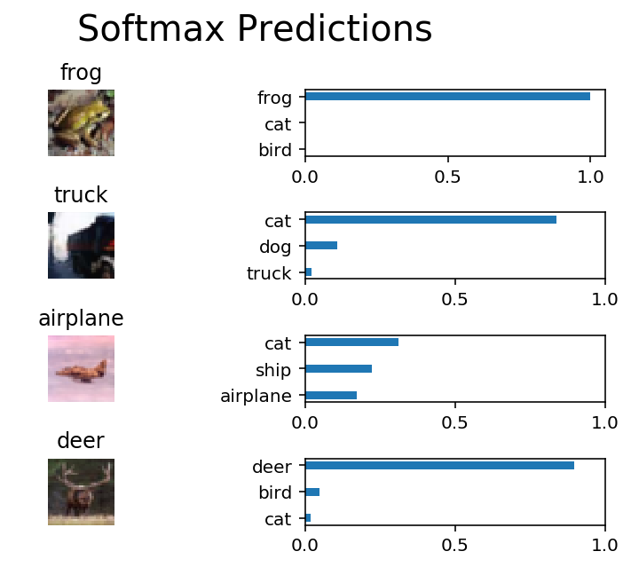

# CIFAR-10 Classifier MLND Project
This is my project for Deep Learning Module of Machine Learning Engineer Nanodegree by Udacity. 
The model is written using core functionalities of TensorFlow

## Model Description

| Layer Number 	| Layer Type     	| Number of Trainable Parameters 	|
|--------------	|----------------	|--------------------------------	|
| 1            	| conv2d_maxpool 	|              1,792             	|
| 2            	| conv2d_maxpool 	|             73,856             	|
| 3            	| conv2d_maxpool 	|             295,168            	|
| 4            	|     flatten    	|                0               	|
| 5            	|   dense_layer  	|            2,097,664           	|
| 6            	|     dropout    	|                0               	|
| 7            	|   dense_layer  	|             262,656            	|
| 8            	| output (Logit) 	|              5,130             	|

Total Trainable Parameters: 2,736,266

## Final Results
Test Accuracy: 0.7091

## A Sample From Test
